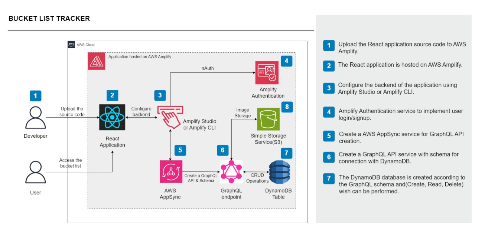
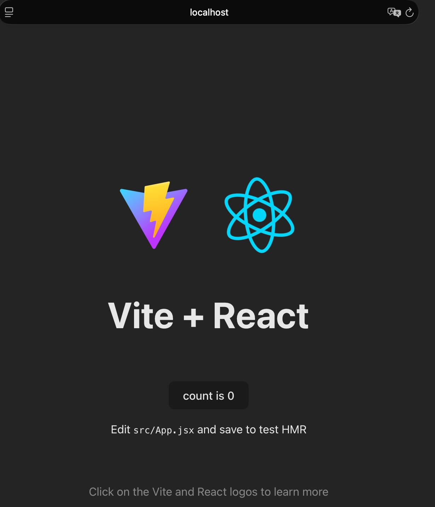
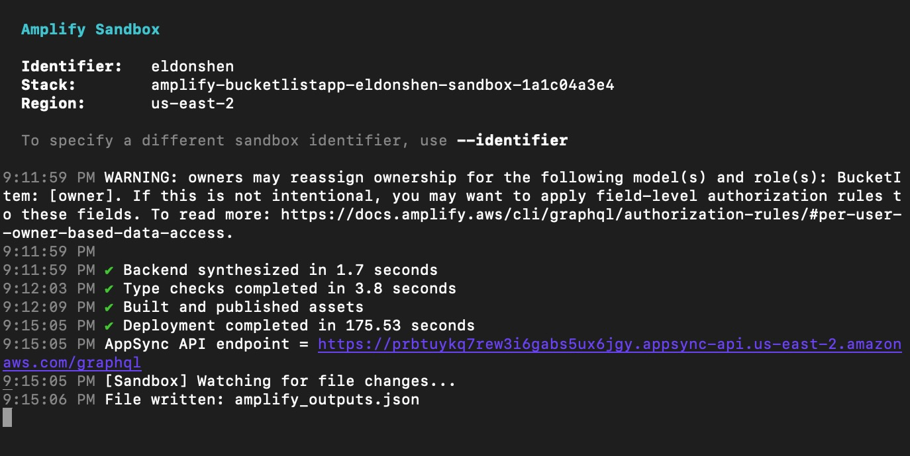
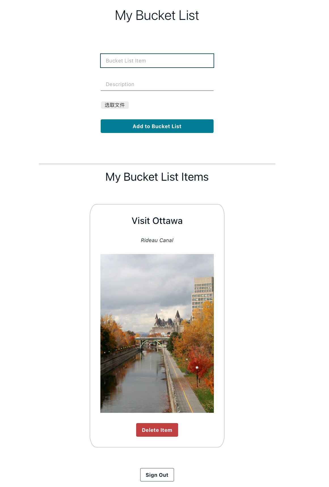

# Bucket List Tracker Application ☁️

A full-stack serverless application built with React and AWS Amplify that allows users to create, manage, and track their bucket list items with image uploads.

## Overview

This project demonstrates how to build and deploy a complete serverless application on AWS Amplify. You'll learn how to create a React frontend, set up authentication, manage data storage, and handle file uploads—all using AWS cloud services.

## Steps to be Performed 👩‍💻

1. **Develop** a bucket list tracker application in React
2. **Initialize** a GitHub repository and connect it to AWS Amplify Hosting
3. **Integrate** Amplify Authentication for user Login/Signup
4. **Create** AWS AppSync GraphQL API for DynamoDB integration
5. **Deploy** backend services on AWS Amplify for data and storage management

## Services Used 🛠

- **AWS Amplify**: Frontend and backend deployment with CI/CD workflow
-**: GraphQL API for seamless data operations
- **Amazon Cognito**: User authentication and authorization
- **Amazon DynamoDB**: NoSQL database for storing bucket list items
- **Amazon S3**: Object storage for user-uploaded images

## Architecture Diagram



---

## Step 1: Create React Application with Vite

AWS Amplify provides a Git-based CI/CD workflow that automatically builds and deploys your application. When connected to a Git repository, Amplify detects build settings and redeploys on every code commit.

### 1.1 Initialize Vite React Project

```bash
npm create vite@latest bucketlistapp -- --template react
cd bucketlistapp
npm install
npm run dev
```

Local development server runs at: http://localhost:5173/



### 1.2 Deploy to AWS Amplify

1. Push your code to a GitHub repository
2. Connect the repository to AWS Amplify Console
3. Configure build settings (see `amplify.yml` configuration below)
4. Deploy automatically on every push

**Production URL**: **https://main.dfnnoiwwumul6.amplifyapp.com/**

#### Amplify Build Configuration (`amplify.yml`)

```yaml
version: 1
frontend:
  phases:
    preBuild:
      commands:
        - cd bucketlistapp
        - npm ci
    build:
      commands:
        - npm run build
  artifacts:
    baseDirectory: bucketlistapp/dist
    files:
      - '**/*'
  cache:
    paths:
      - bucketlistapp/node_modules/**/*
```

---

## Step 2: Setup AWS Amplify Backend

Configure authentication, data storage, and file storage for your bucket list application.

### 2.1 Authentication

Authentication is pre-configured in `bucketlistapp/amplify/auth/resource.ts`:

```typescript
import { defineAuth } from '@aws-amplify/backend';

export const auth = defineAuth({
  loginWith: {
    email: true,
  },
});
```

### 2.2 Data Storage (DynamoDB)

Update `bucketlistapp/amplify/data/resource.ts` to define the bucket list item model:

```typescript
import { type ClientSchema, a, defineData } from '@aws-amplify/backend';

const schema = a.schema({
  BucketItem: a
    .model({
      title: a.string(),
      description: a.string(),
      image: a.string(),
    })
    .authorization((allow) => [allow.owner()]),
});

export type Schema = ClientSchema<typeof schema>;

export const data = defineData({
  schema,
  authorizationModes: {
    defaultAuthorizationMode: 'userPool',
  },
});
```

**Authorization**: Only the item owner can access their data.

### 2.3 File Storage (S3)

Create `bucketlistapp/amplify/storage/resource.ts`:

```typescript
import { defineStorage } from "@aws-amplify/backend";

export const storage = defineStorage({
  name: "amplifyBucketTrackerImages",
  access: (allow) => ({
    "media/{entity_id}/*": [
      allow.entity("identity").to(["read", "write", "delete"]),
    ],
  }),
});
```

**Access Control**: Only the user who uploads an image can access it.

### 2.4 Backend Configuration

Update `bucketlistapp/amplify/backend.ts` to link all resources:

```typescript
import { defineBackend } from '@aws-amplify/backend';
import { auth } from './auth/resource';
import { data } from './data/resource';
import { storage } from './storage/resource';

defineBackend({
  auth,
  data,
  storage,
});
```

### 2.5 Deploy Cloud Sandbox

Deploy your backend to an isolated cloud development environment:

```bash
npx ampx sandbox
```

**What happens:**
- Deploys authentication, data, and storage to AWS Cloud
- Generates `amplify_outputs.json` configuration file
- Keeps resources synced with local changes

**Output:**
- ✅ "Sabox deployed successfully"
- 📄 `amplify_outputs.json` file created in `bucketlistapp/` folder

⚠️ **Keep the sandbox terminal running during development**



---

## Step 3: Connect Frontend and Backend

Build the UI and integrate with cloud services for authentication and data management.

### 3.1 Install Amplify Libraries

```bash
npm install aws-amplify @aws-amplify/ui-react
```

These libraries provide:
- Client-side APIs for backend services
- Pre-built authentication UI components

### 3.2 Update UI Components

**Update `bucketlistapp/src/index.css`**: Set layout and styles for the bucket list UI

**Update `bucketlistapp/src/App.jsx`**: Configure authentication and CRUD operations

Key features in `App.jsx`:
- `Amplify.configure(outputs)` - Connects to backend
- `<Authenticator>` - Provides login/signup UI
- CRUD operations via GraphQL client
- Image upload/download from S3

### 3.3h the App Locally

```bash
npm run dev
```

1. Open **http://localhost:5173/**
2. Click **"Create Account"** tab
3. Enter email and password
4. Complete sign-up process

---

## Step 4: Test the Application

### Add a Bucket List Item

**Example:**
- **Title**: "Visit Paris"
- **Description**: "See the Eiffel Tower and walk along the Seine"
- **Upload Image**: Paris.jpg



### Behind the Scenes - AWS Workflow

#### Step 1: Database Storage (DynamoDB)
- Item metadata (title, description, image filename) saved via AppSync GraphQL API
- Only accessible by the authenticated owner

#### Step 2: File Storage (S3)
- Image uploaded to S3 bucket via Amplify Storage
- **Path**: `media/{your-user-id}/{filename}`
- Access restricted to owner only

#### Step 3: Display
- App fetches items from DynamoDB
- Generates secure pre-signed URLs for S3 images
- Renders bucket list with images in the UI

### CRUD Operations

- ✅ **Create**: Add new bucket list items with images
- 📖 **Read*iew all your bucket list items
- 🗑️ **Delete**: Remove items from your list
- 🔐 **Secure**: All data isolated per user

---

## Deployment Workflow

### Local Development
1. Run sandbox: `npx ampx sandbox` (keep running)
2. Run dev server: `npm run dev` (in new terminal)
3. Make changes and test locally

### Production Deployment
1. Commit changes: `git add . && git commit -m "message"`
2. Push to GitHub: `git push`
3. AWS Amplify automatically builds and deploys
4. Monitor deployment in Amplify Console

**No manual redeployment needed** - CI/CD handles everything automatically!

---

## Project Structure

```
AWS-Amplify-Serverless-Application/
├── bucketlistapp/
│   ├── amplify/
│   │   ├── auth/resource.ts       # Authentication config
│   │   ├── data/resource.ts       # DynamoDB schema
│   │   ├── storage/resource.ts    # S3 storage config
│   │   └── backend.ts             # Backend integration
│   ├── src/
│   │   ├── Appyles
│   ├── amplify_outputs.json       # Backend configuration (generated)
│   └── package.json
├── Diagram.jpeg                   # Architecture diagram
├── ReactAPP.jpeg                  # React app screenshot
├── DeploySandbox.jpeg             # Sandbox deployment
├── TestApp.jpeg                   # Application testing
└── README.md
```

---

## Key Takeaways

✅ **Serverless Architecture**: No server management required  
✅ **Automatic Scaling**: AWS handles traffic increases  
✅ **Secure by Default**: User isolation and authentication built-in  
✅ **CI/CD Pipeline**: Automatic deployments on code push  
✅ **Full-Stack Solution**: Frontend, backend, auth, and storage integrated seamlessly

---

## Resources

- [AWS Amplify Documentation](https://docs.amplify.aws/)
- [AWS AppSync Documentation](https://docs.aws.amazon.com/appsync/)
- [Vite Documentation](https://vitejs.dev/)
- [React Documentation](https://react.dev/)
